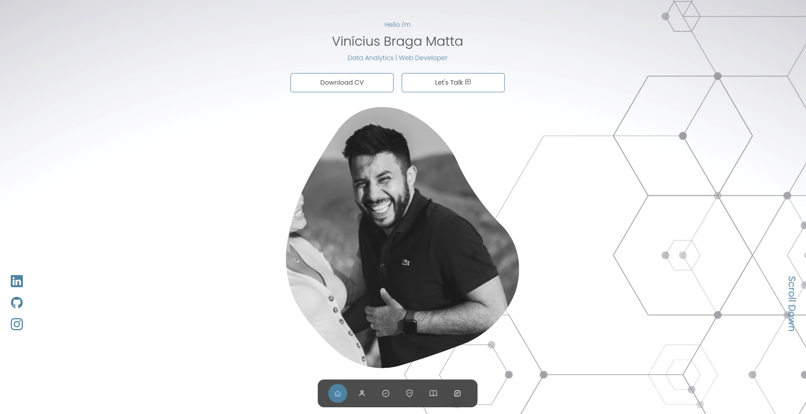

# My Personal Portfolio

Bem-vindo ao meu portfólio! Aqui você encontrará uma amostra do meu trabalho como analista de dados e desenvolvedor web. 
Criado utilizando JavaScript, Tailwind e React Icons, este portfólio apresenta projetos que demonstram minha capacidade de transformar dados em insights e criar interfaces atraentes. Explore e descubra como a análise de dados se funde harmoniosamente com o design web."
<div>
    
 
</div>


## Visite o Portfolio
https://portfolio-bay-two-82.vercel.app/

## Instalação
1.Certifique-se de ter o Node.js instalado.
2.Clone este repositório para o seu ambiente local usando:
```bash
git clone https://github.com/VinicinBraga/Portfolio.git
```

3.Acesse o diretório do projeto:
```bash
cd E-commerce-App
```
4.Instale as dependências do projeto:
```bash
npm install
```

## Como usar
npm run dev

## Contribuição
Contribuições são bem-vindas! Se você encontrar bugs, problemas ou tiver melhorias a serem sugeridas, abra uma issue ou envie uma solicitação de pull.

## Licença
Este projeto está licenciado sob a MIT License.

## Contato
Se você tiver alguma dúvida ou precisar entrar em contato, pode me encontrar em:

Email: vinicius@bragamatta.com ou vinibm85@gmail.com

GitHub: https://github.com/VinicinBraga

Linkedin: https://www.linkedin.com/in/vinícius-braga
